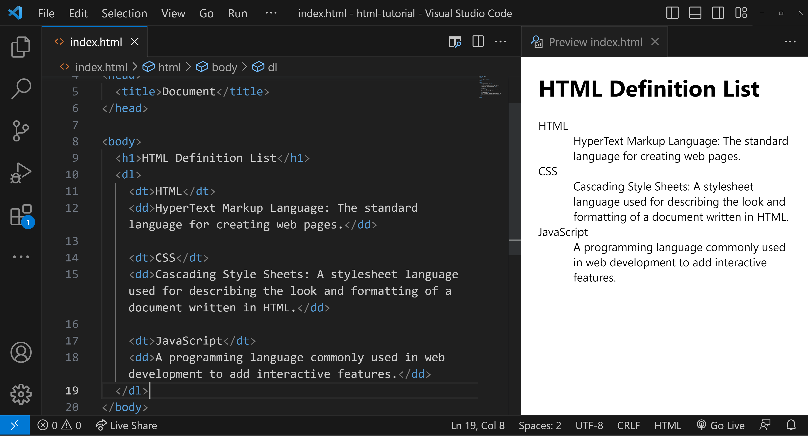

# HTML_Part_2

---

## HTML Lists

HTML lists are an integral part of web development, allowing developers to display data neatly. This guide will cover the types of HTML lists, their attributes, and examples of their usage.

---

## HTML Attributes

HTML attributes provide additional information about HTML elements. For instance, the `lang` attribute in `<html lang=”en”>` specifies the language of the web page's content.

With a solid understanding of HTML lists and their attributes, you can improve the readability of content and data on your web pages.

---

## Types of HTML Lists

HTML offers three types of lists:

1. **Unordered List:** Displays items with bullets. There's no specific sequence required.
2. **Ordered List:** Presents items in a numerical sequence, supporting various numbering styles.
3. **Definition List:** Organizes items like a dictionary, with terms and their corresponding definitions.

---

### 1. Unordered List

Defined using the `<ul>` tag, unordered lists are typically displayed as bullet points. Individual items use the `<li>` tag.

**Example:**

```html
<ul>
  <li>Pen</li>
  <li>Pencil</li>
  <li>Eraser</li>
</ul>
```

### Output:

- Pen
- Pencil
- Eraser

With the `type` attribute, you can change the style of the bullet points to `disc` (default), `square`, or `circle`.

---

### 2. Ordered List

Ordered lists, created with the `<ol>` tag, are used for items that follow a sequence. List items are enclosed within `<li>` tags.

**Example:**

```html
<ol>
  <li>Mango</li>
  <li>Orange</li>
  <li>Litchi</li>
</ol>
```

### Output:

1. Mango
2. Orange
3. Litchi

The `type` attribute adjusts the style of numbering. Options include uppercase Roman numerals (`type="I"`), lowercase Roman numerals (`type="i"`), Arabic numerals (`type="1"`), lowercase alphabetical letters (`type="a"`), and uppercase alphabetical letters (`type="A"`).

---

### 3. Definition List

In HTML, a definition list represents terms and their descriptions. It's created with the `<dl>` element, enclosing pairs of `<dt>` (term) and `<dd>` (description).

Example:



### **Understanding the example**

In this example:

- `<dl>` is the container for the list.
- `<dt>` defines the terms that you want to explain.
- `<dd>` contains the definitions or explanations for the terms.

---

## **Anchor Tag**

Links are fundamental to navigating the web. In HTML, links are created using the `<a>` tag, also known as the Anchor tag.

- Specified by the `<a>` tag.
- Also known as hyperlinks.
- Used to link one document to another.
- Includes a closing tag `</a>`.

**Example :** 

```html
<a href="Your specified path">content</a>
```

**Target Attribute Values**

- **_blank:** Opens the linked document in a new window or tab.
- **_top:** Opens document in the full body of the window.
- **_self:** Opens document in the same window or tab (default behavior).
- **_parent:** Opens the linked document in the parent frame.

**Note** : links are of 2 types

| Absolute link | A full web address |
| --- | --- |
| Relative link | local system file or a link to a page within the same website |

---

## Image Tag

The `` tag is used to add images to a web page

**Example :** 

```html

```

Although dimensions can be set using the "width" and "height" attributes in the `` tag, modern best practices recommend using CSS for this purpose.

---

## Othe HTML Tags

these are inline tags

| Bold `<b>` | Makes text bold |
| --- | --- |
| Italic `<i>` | Makes text italic |
| Underline `<u>` | Underlines the text |

---

## Comments in HTML

This is the part of code that should not be rendered (used to add key points)

`<!— comment —>`

VS_CODE(TIP) : Use ctrl + / to make selected code as comeent

---